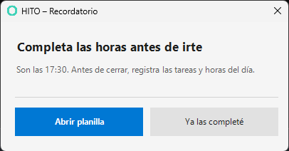
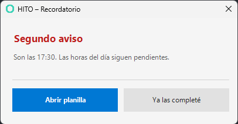
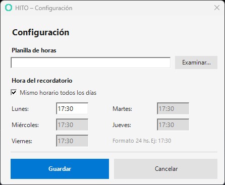
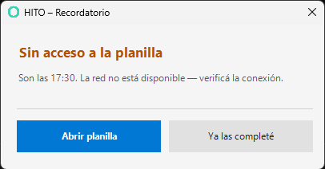

# HITO

**Recordatorio diario para completar la planilla de horas**
Windows 10 / 11 · No requiere permisos de administrador · v1.0.0


---

## Capturas de pantalla

**Ventana de recordatorio**



**Ventana de recordatorio - Segundo aviso**



**Configuración**



**Red no disponible**



---

## Qué hace

De lunes a viernes, a la hora configurada, aparece una ventana que recuerda completar la planilla de horas antes de terminar el día.
Dos opciones:

- **Abrir planilla** — abre el archivo Excel directamente.
- **Ya las completé** — cierra el aviso y registra el día como listo.

Si no se responde en 15 minutos, aparece un segundo aviso. Cada interacción queda registrada en `log.txt` (fecha, día, estado y hora).

---

## Estructura del proyecto

```
HITO/
├── hito.ps1              # Script principal. Muestra la ventana de recordatorio.
├── configurar.ps1        # Formulario de configuración. Accesible desde el Menú Inicio.
├── desinstalar.ps1       # Desinstalador. Accesible desde el Menú Inicio.
├── aplicar_horarios.ps1  # Script auxiliar. Restaura los horarios personalizados al reinstalar.
├── lanzar.vbs            # Lanzador silencioso. Ejecuta los scripts sin ventana de consola.
├── instalar.bat          # Instalador. Ejecutar una vez por PC.
│
├── .github/
│   └── workflows/
│       └── ci.yml        # Pipeline de CI (verificación de sintaxis, encoding y lint).
│
├── docs/                 # Capturas de pantalla
│
├── hito.ico
├── README.md
├── CHANGELOG.md
├── LICENSE
└── .gitignore
```

Los siguientes archivos **no están en el repositorio** y se generan localmente:

| Archivo       | Cuándo se crea |
|---------------|----------------|
| `config.json` | Al guardar por primera vez en Configuración. Contiene la ruta de la planilla y los horarios. |
| `log.txt`     | Al primer uso del recordatorio. Una línea por interacción con fecha, día y acción. |
| `hito.ico`    | No se genera automáticamente — colocarlo en la misma carpeta que `instalar.bat` para activar el ícono personalizado en las ventanas y accesos directos. |

---

## Instalación

Repetir estos pasos en cada equipo.

**Paso 1 — Ejecutar el instalador**

- Colocar los siete archivos (`instalar.bat`, `hito.ps1`, `configurar.ps1`, `desinstalar.ps1`, `aplicar_horarios.ps1`, `lanzar.vbs` y `hito.ico`) en la misma carpeta.
- Hacer doble clic en `instalar.bat`. La consola debe mostrar todos los mensajes `[OK]`.

**Paso 2 — Configurar la planilla personal**

- Abrir el Menú Inicio → carpeta **HITO** → **Configuración**.
- Hacer clic en **Examinar** y seleccionar la planilla Excel personal (`.xlsm`, `.xlsx` o `.xls`).
- Ajustar los horarios si se desea (por defecto 17:30 todos los días). Se acepta punto, coma o dos puntos como separador (`17.30`, `17,30` o `17:30`).
- Hacer clic en **Guardar**. Las tareas programadas se actualizan en el momento.

---

## Archivos instalados

El instalador copia los archivos a `%USERPROFILE%\HITO` (por ejemplo `C:\Users\Juan\HITO`).
Esta es la única carpeta que usa el sistema. No se modifica el registro de Windows ni se instala ningún programa adicional.

### Archivos copiados por el instalador

| Archivo                | Descripción |
|------------------------|-------------|
| `hito.ps1`             | Script principal. Muestra la ventana de recordatorio. |
| `configurar.ps1`       | Formulario de configuración. |
| `desinstalar.ps1`      | Desinstalador. |
| `aplicar_horarios.ps1` | Script auxiliar. Restaura los horarios personalizados al reinstalar. |
| `lanzar.vbs`           | Lanzador silencioso. Evita el parpadeo de consola al ejecutar los scripts. |
| `hito.ico`             | Ícono de las ventanas. Solo se copia si estaba presente en la carpeta del instalador. |

### Archivos generados automáticamente

| Archivo | Cuándo se crea |
|---|---|
| `config.json` | Al guardar por primera vez en Configuración. Contiene la ruta de la planilla y los horarios. |
| `log.txt` | Al primer uso del recordatorio. Una línea por interacción con fecha, día y acción. |

### ¿Se puede eliminar la carpeta original del instalador?

Sí. Una vez que `instalar.bat` terminó con todos los mensajes `[OK]`, los archivos ya están copiados en `%USERPROFILE%\HITO` y la carpeta original no es necesaria. Puede descartarse o guardarse como respaldo para reinstalar en otro equipo.

La excepción es `hito.ico`: si no estaba presente al instalar, se puede agregar luego re-ejecutando el instalador desde la carpeta original con el ícono incluido.

---

## Desinstalación

Abrir el Menú Inicio → carpeta **HITO** → **Desinstalar**.

Confirmar en la ventana de advertencia. El desinstalador elimina las tareas programadas, los accesos directos y la carpeta de instalación completa. No quedan rastros en el sistema.

> El sistema no modifica el registro de Windows ni instala ningún programa adicional.

---

## Cambiar la planilla o el horario

Abrir el Menú Inicio → carpeta **HITO** → **Configuración**.

El formulario muestra la configuración actual. Modificar lo necesario y hacer clic en **Guardar**.
El cambio tiene efecto inmediato, sin necesidad de tocar el Programador de tareas.

Hacer esto si se renombra la planilla, se empieza a usar un archivo nuevo (por ejemplo al inicio de cada año), o si se quiere ajustar la hora del recordatorio.

---

## Probar sin esperar la hora configurada

Abrir PowerShell (sin necesidad de ejecutar como administrador) y usar los siguientes comandos.

**Ver la ventana de recordatorio**
```powershell
powershell -ExecutionPolicy Bypass -File "$env:USERPROFILE\HITO\hito.ps1" -Test
```

**Simular el segundo aviso**
```powershell
powershell -ExecutionPolicy Bypass -File "$env:USERPROFILE\HITO\hito.ps1" -Test -Segundo
```

**Abrir el configurador**
```powershell
powershell -ExecutionPolicy Bypass -File "$env:USERPROFILE\HITO\configurar.ps1"
```

**Abrir el desinstalador**
```powershell
powershell -ExecutionPolicy Bypass -File "$env:USERPROFILE\HITO\desinstalar.ps1"
```

**Simular red no disponible**
```powershell
powershell -ExecutionPolicy Bypass -File "$env:USERPROFILE\HITO\hito.ps1" -Test -SinRed
```

---

## Comportamiento del sistema día a día

**Situación normal**
A la hora configurada aparece la ventana. Se hace clic en un botón y listo hasta el día siguiente.

**Si la PC estaba apagada o suspendida a la hora configurada**
El recordatorio se ejecuta automáticamente al volver a encender o desbloquear, siempre que sea el mismo día calendario. Si se retoma al día siguiente, no aparece ningún aviso.

**Si la red no está disponible**
La ventana aparece igual pero con un aviso en naranja indicando que la red no está disponible. El botón Abrir planilla muestra una advertencia adicional. El recordatorio nunca se cancela silenciosamente.

**Qué pasa con cada acción sobre el primer aviso**

| Acción                  | Cancela el segundo aviso | Registra en el log           |
|-------------------------|--------------------------|------------------------------|
| Abrir planilla          | Sí                       | Sí → "Abrio planilla"        |
| Ya las completé         | Sí                       | Sí → "Completado"            |
| Cerrar con la X         | **No**                   | Sí → "Cerrado sin respuesta" |
| Ignorar (dejar abierta) | **No**                   | No (hasta que se interactúe) |

Si no se hace nada en 15 minutos, aparece el segundo aviso. El comportamiento de los botones es idéntico al del primero. Si tampoco se responde el segundo aviso, queda registrado "Cerrado sin respuesta" al cerrarlo, o nada si se deja abierto indefinidamente.

**Formato del log**

Cada interacción queda en una línea del archivo `log.txt`. El log es acumulativo, todas las acciones del día quedan registradas, no solo la última.

```
2026-05-12 | Martes | 1er aviso | Cerrado sin respuesta | 17:33
2026-05-12 | Martes | 2do aviso | Abrio planilla        | 17:51
```

---

## Requisitos

- Windows 10 u 11.
- Acceso a la unidad o carpeta de red donde está guardada la planilla personal (unidad mapeada, ruta UNC `\\servidor\carpeta`, o archivo local).
- PowerShell (incluido en todas las versiones de Windows 10 y 11).

---

## Resolución de problemas

| Problema | Solución |
|----------|----------|
| No aparece el recordatorio a la hora configurada | Verificar que las 5 tareas (`HITO_Lun` / `_Mar` / `_Mie` / `_Jue` / `_Vie`) existan y estén habilitadas en el Programador de tareas. Verificar la hora en Configuración. |
| Aparece "Archivo no encontrado" | Verificar que la unidad de red esté conectada y que la ruta sea exacta. Abrir Configuración y seleccionar el archivo nuevamente con Examinar. |
| No aparece la carpeta HITO en el Menú Inicio | Re-ejecutar `instalar.bat`. |
| Error al ejecutar el script manualmente | Usar siempre el archivo `.ps1` descargado. No copiar y pegar el contenido en un archivo nuevo, ya que puede alterar el encoding y romper el script. |
| El horario no se aplica correctamente | Abrir Configuración y verificar la hora del día en cuestión (formato `HH:MM`, `HH.MM` o `HH,MM`, 24 horas). Confirmar que las 5 tareas existen en el Programador de tareas. |
| El segundo aviso no aparece | La tarea de reintento se crea al mostrarse el primer popup y se dispara 15 minutos después. Si se hizo clic en cualquier botón, se cancela automáticamente. Si el popup fue cerrado con la X o ignorado, el segundo aviso sí debería aparecer. |
| No se puede seleccionar la planilla con Examinar | Verificar que la unidad de red esté montada antes de abrir Configuración. |
| La ventana aparece aunque ya se completó la planilla | Suele pasar si el popup fue cerrado con la X en lugar de usar el botón. Siempre hacer clic en **Ya las completé** para cerrar correctamente. |
| Las ventanas no muestran el ícono de HITO | El archivo `hito.ico` no estaba presente al instalar. Colocarlo en la misma carpeta que `instalar.bat` y re-ejecutar el instalador. |

---

## Changelog

Ver [CHANGELOG.md](CHANGELOG.md).

---

## Licencia

MIT — ver [LICENSE](LICENSE).

---

## Autor

Desarrollado por **Sebastián A. Roskopf** — [GitHub](https://github.com/seba-rsk)